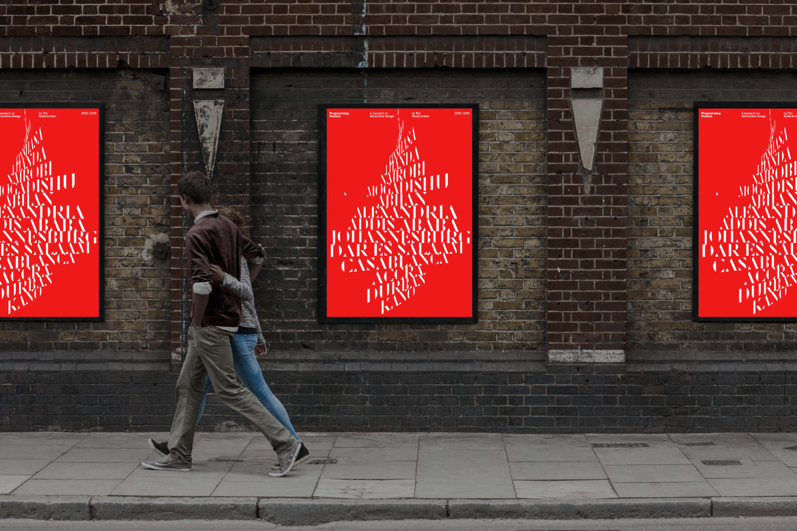

# The official Programming Posters repository

## Restrictions

### colors and dimensions

```java
// colors
color WHITE = #F1F1F1;
color RED = #FF0000;

// dimensions
float POSTER_W = 586;
float POSTER_H = 810;
```

### Fonts

Use any weight and style from Roboto, Roboto and RobotoCondensed!
